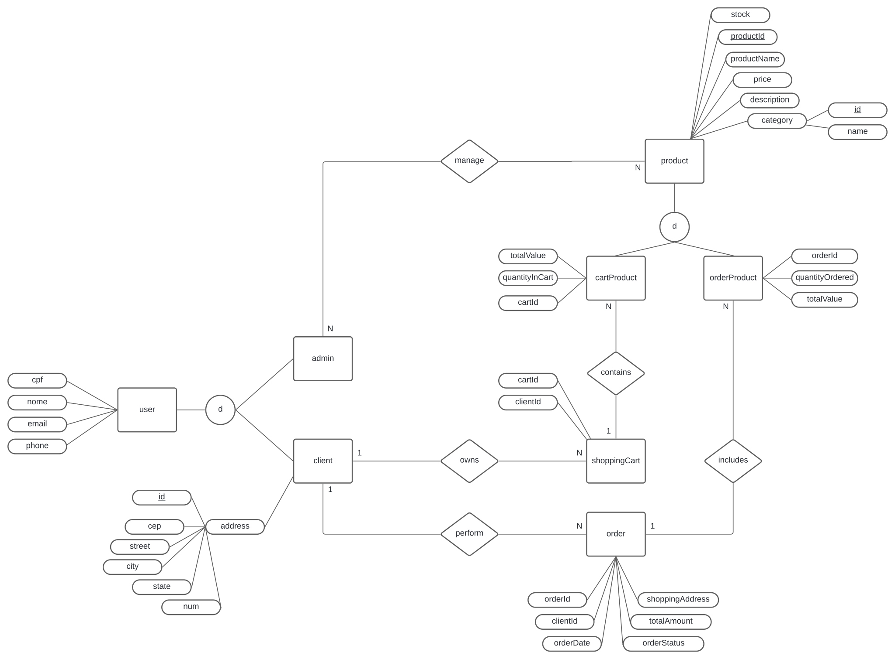

<p align="center">
  <a href="http://nestjs.com/" target="blank"></a>
</p>


## Installation

```bash
$ npm install
```

## Running the app

```bash
# development
$ npm run start

# watch mode
$ npm run start:dev

# production mode
$ npm run start:prod
```

## Test

```bash
# unit tests
$ npm run test
```

## Swagger Api Doc
```bash
# npm run start:dev
$ and open http://localhost:3000/api-docs
````
